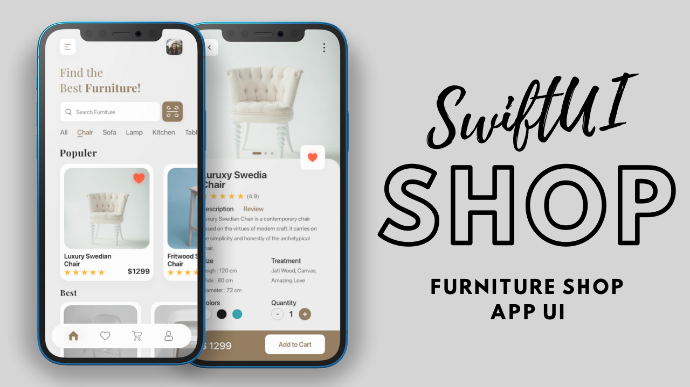

# Furniture Shop App UI - SwiftUI

We design two screens of a furniture shop app by using SwiftUI. The Home page at the top contains the menu and profile button. Then search and filter at the end horizontal list of products with two categories one is popular and another one is best. Also, there is a category list.
On the Details page of our furniture shop has full info of that product also add to cart at the bottom.

### Furniture Shop App Final UI

